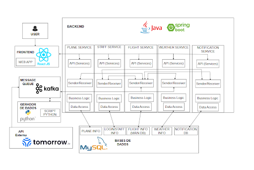

# ies-24-25-group-project-105

# FlyQuest

FlyQuest é um software desenvolvido para uma companhia aérea e permite gerenciar os aspetos operacionais relacionados aos voos. Esta app destina-se a administradores e equipas de bordo, facilitando a organização, agendamento e comunicação. Assim, as equipas podem-se manter informadas sobre as alterações efetuadas nos seus voos.
O nosso sistema integra uma API externa **tomorrow.io** para atualização ao minuto das condições meteorológicas. Isto permite fazer a monitorização do tempo com o objetivo de descobrir se é necessário cancelar um voo previamente.

# Roles

| Role | Nome | NMec |
|:---:|:---|:---:|
| Team Manager | Rodrigo Abreu | 113626 |
| Project Owner | Tomás Brás | 112665 |
| Architect | Hugo Ribeiro | 113402 |
| DevOps Master | Eduardo Lopes | 103070 |

# Architectural View 

# API Documentation
[API Documentation](reports/API_Endpoints.md)

### Project resources :

- Swagger : http://deti-ies-05.ua.pt:8090/swagger-ui/index.html (only within the UA network)
- FlyQuest Github Backlog : https://github.com/orgs/detiuaveiro/projects/59
- Report FlyQuest: https://docs.google.com/document/d/1W2mSj8HIwgNWM1AnB5l3ioyxLao2c4FskPW7sKFNlyY/edit?usp=sharing
